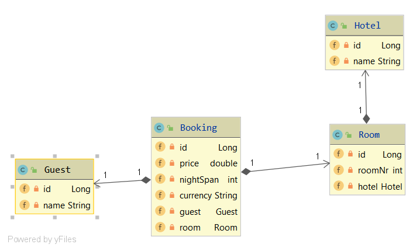

= Übung 3

[%interactive]
* [ ] Datenbank-Tests mit AssertJ-DB
* [ ] Erstellen einer Dokumentation mit Asciidoctor
* [ ] Arbeiten mit Quarkus
* [ ] Verwenden von Hibernate
* [ ] Verwenden von Panache

== Asciidoctor

https://asciidoctor.org/docs/user-manual/
https://asciidoctor.org/docs/asciidoc-syntax-quick-reference/

== Projekterstellung

Erstellen des Projektes

----
./mvnw io.quarkus:quarkus-maven-plugin:0.22.0:create \
-DprojectGroupId=at.htl \
-DprojectArtifactId=hotel-manager \
-DclassName="at.htl.quickstart.GreetingResource" \
-Dpath="/hello"
-Dextensions="resteasy-jsonb"
----

Falls man weitere Extensions nachträglich hinzufügen will

----
./mvnw quarkus:add-extension -Dextensions="resteasy-jsonb"

----

Kompilieren und ausführen des Projektes

----
./mvnw compile quarkus:dev
----

== Hotel Manager/Management

*CLD* (temporär)

== REST

* [x] GET
* [ ] POST
* [ ] DELETE

*GET*

----
curl -X GET http://localhost:8080/hotel
curl -X GET http://localhost:8080/guest
curl -X GET http://localhost:8080/booking
curl -X GET http://localhost:8080/room
----

=== Hibernate

----
<dependencies>
    <!-- Hibernate ORM specific dependencies -->
    <dependency>
        <groupId>io.quarkus</groupId>
        <artifactId>quarkus-hibernate-orm</artifactId>
    </dependency>

    <!-- JDBC driver dependencies -->
    <dependency>
        <groupId>io.quarkus</groupId>
        <artifactId>quarkus-jdbc-postgresql</artifactId>
    </dependency>
</dependencies>
----

==== Docker

----
docker pull postgres
docker run -e POSTGRES_PASSWORD=passme -e POSTGRES_USER=user -e POSTGRES_DB=mydatabase -d -p 5432:5432 postgres
----

*Docker IP* : 192.168.99.100

Auf Windows muss man *localhost* mit der *Docker IP* ersetzen.

----
docker ps -a
docker ps
docker stop [CONTAINER ID]
----

[horizontal, role="properties", options="step"]

docker ps -a:: Zeigt jeden Container an
docker ps:: Zeigt jeden laufenden Container an
docker stop [CONTAINER ID]:: Beendet den gewählten Container (3 ID-Stellen genügen)

==== application.properties

----
//quarkus.datasource.url = jdbc:postgresql://localhost:5432/mydatabase
quarkus.datasource.url = jdbc:postgresql://192.168.99.100:5432/mydatabase
quarkus.datasource.driver = org.postgresql.Driver
quarkus.datasource.username = user
quarkus.datasource.password = passme

quarkus.hibernate-orm.database.generation=drop-and-create
----

https://quarkus.io/guides/hibernate-orm

<<<

Panache

https://quarkus.io/guides/hibernate-orm-panache

